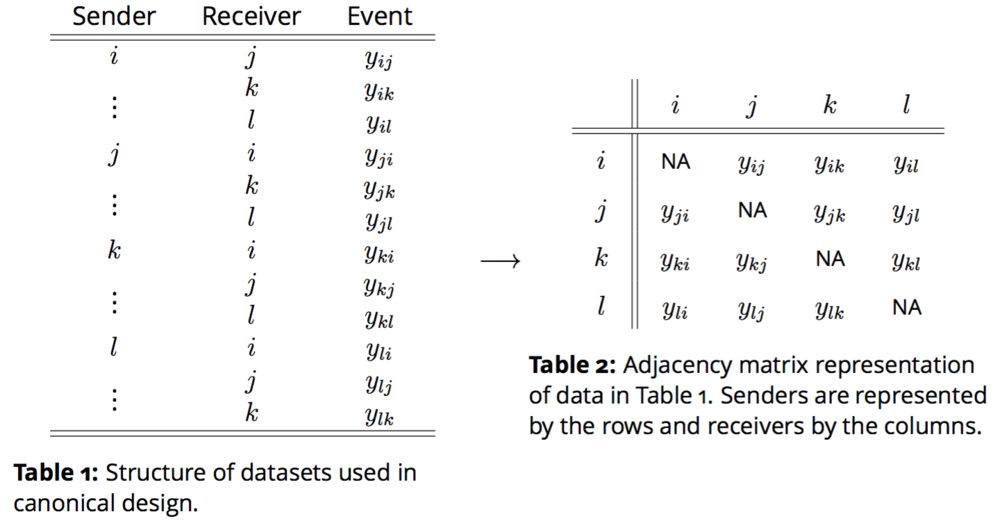
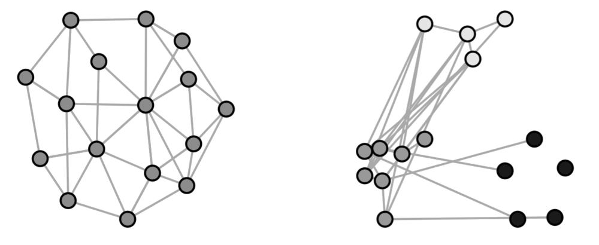
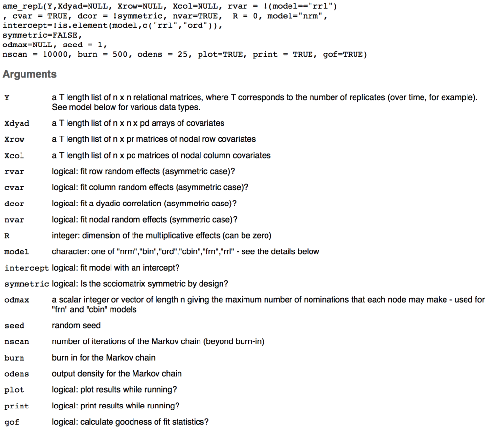
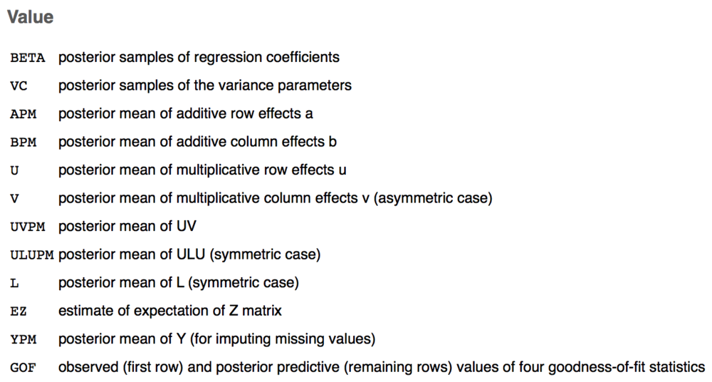

```{r setup, include=FALSE}
knitr::opts_chunk$set(echo = FALSE)

if(Sys.info()['user']=='janus829' | Sys.info()['user']=='s7m'){
	dropPath = '~/Dropbox/Research/netsMatter/replications/example/'
	gitPath = '~/Research/netsMatter/'
	dataPath = paste0(dropPath, 'inputData/')
	resultsPath = paste0(dropPath, 'outputData/') }
```

## Purpose

* Why are we meeting during Thanksgiving weekend...I didn't realize the date and none of you objected :)
* Anyhow...we are here to talk about conducting a meta-analysis of dyadic studies in political science using the Additive and Multiplicative Effects Model for Networks (AMEN)
* What I hope we find from this project is that using standard GLM approaches on dyadic data produces
      - biased estimates of the effect of independent variables
      - uncalibrated confidence intervals
      - and poor predictive performance.
* Anticipated outputs: 
      - One big meta-analysis piece in which we show the items in the list above to be true on average
      - <span style="color:red">**After**</span> big project is done, a number of small replication pieces
      - New disciples to spread the gospel

## Outline

* **Brief** background discussion of AMEN based on [Hoff's vignette](https://arxiv.org/pdf/1506.08237v1.pdf) and a [joint piece with me and Mike](https://arxiv.org/pdf/1611.00460v1.pdf)
* Example application of AMEN, where we will   
      - Discuss how to structure input data
      - Extract and interpret model results
      - Conduct out-of-sample performance on longitudinal networks
* Discuss project management

## Dyadic data

* Any dataset in which the unit of observation is characterized by a pair of actors
      - MIDs
      - International economic agreements (PTAs, BITs)
      - Alliances (NATO)
      - Trade flows

## What makes dyadic data special

* Formation of a tie between any pair of actors is **not necessarily** independent of other ties
      - This is true for bilateral and multilateral events
* Why?

## Actors are part of a system ... a network

```{r, out.width= "700px",fig.align="center"}

```

## Flavors of dependencies

* First order dependence
      - Often will find significant heterogeneity in activity levels across nodes
* Second order dependence
      - Reciprocity: Event sent from i $\rightarrow$ j is likely related to an event sent from j $\rightarrow$ i

## What to do: Social Relations Model

$$
\begin{aligned}
      y_{ij} &= \color{red}{\mu} + \color{red}{e_{ij}} \\
      e_{ij} &= a_{i} + b_{j} + \epsilon_{ij} \\
      \{ (a_{1}, b_{1}), \ldots, (a_{n}, b_{n}) \} &\sim N(0,\Sigma_{ab}) \\ 
      \{ (\epsilon_{ij}, \epsilon_{ji}) : \; i \neq j\} &\sim N(0,\Sigma_{\epsilon}), \text{ where } \\
      \Sigma_{ab} = \begin{pmatrix} \sigma_{a}^{2} & \sigma_{ab} \\ \sigma_{ab} & \sigma_{b}^2   \end{pmatrix} \;\;\;\;\; &\Sigma_{\epsilon} = \sigma_{\epsilon}^{2} \begin{pmatrix} 1 & \rho \\ \rho & 1  \end{pmatrix}
\end{aligned}
$$

* $\mu$ baseline measure of network activity, for the purpose of regression we turn this into $\beta^{T}X$
* $e_{ij}$ residual variation that we will use the SRM to decompose

## What to do: Social Relations Model

$$
\begin{aligned}
      y_{ij} &= \mu + e_{ij} \\
      e_{ij} &= \color{red}{a_{i} + b_{j}} + \epsilon_{ij} \\
      \color{red}{\{ (a_{1}, b_{1}), \ldots, (a_{n}, b_{n}) \}} &\sim N(0,\Sigma_{ab}) \\ 
      \{ (\epsilon_{ij}, \epsilon_{ji}) : \; i \neq j\} &\sim N(0,\Sigma_{\epsilon}), \text{ where } \\
      \Sigma_{ab} = \begin{pmatrix} \sigma_{a}^{2} & \sigma_{ab} \\ \sigma_{ab} & \sigma_{b}^2   \end{pmatrix} \;\;\;\;\; &\Sigma_{\epsilon} = \sigma_{\epsilon}^{2} \begin{pmatrix} 1 & \rho \\ \rho & 1  \end{pmatrix}
\end{aligned}
$$

* row/sender effect ($a_{i}$) & column/receiver effect ($b_{j}$)
* Modeled jointly to account for correlation in how active an actor is in sending and receiving ties

## What to do: Social Relations Model

$$
\begin{aligned}
      y_{ij} &= \mu + e_{ij} \\
      e_{ij} &= a_{i} + b_{j} + \epsilon_{ij} \\
      \{ (a_{1}, b_{1}), \ldots, (a_{n}, b_{n}) \} &\sim N(0,\color{red}{\Sigma_{ab}}) \\ 
      \{ (\epsilon_{ij}, \epsilon_{ji}) : \; i \neq j\} &\sim N(0,\Sigma_{\epsilon}), \text{ where } \\
      \color{red}{\Sigma_{ab}} = \begin{pmatrix} \sigma_{a}^{2} & \sigma_{ab} \\ \sigma_{ab} & \sigma_{b}^2   \end{pmatrix} \;\;\;\;\; &\Sigma_{\epsilon} = \sigma_{\epsilon}^{2} \begin{pmatrix} 1 & \rho \\ \rho & 1  \end{pmatrix}
\end{aligned}
$$

* $\sigma_{a}^{2}$ and $\sigma_{b}^{2}$ capture heterogeneity in the row and column means
* $\sigma_{ab}$ describes the linear relationship between these two effects (i.e., whether actors who send [receive] a lot of ties also receive [send] a lot of ties)

## What to do: Social Relations Model

$$
\begin{aligned}
      y_{ij} &= \mu + e_{ij} \\
      e_{ij} &= a_{i} + b_{j} + \color{red}{\epsilon_{ij}} \\
      \{ (a_{1}, b_{1}), \ldots, (a_{n}, b_{n}) \} &\sim N(0,\Sigma_{ab}) \\ 
      \color{red}{\{ (\epsilon_{ij}, \epsilon_{ji}) : \; i \neq j\}} &\sim N(0,\color{red}{\Sigma_{\epsilon}}), \text{ where } \\
      \Sigma_{ab} = \begin{pmatrix} \sigma_{a}^{2} & \sigma_{ab} \\ \sigma_{ab} & \sigma_{b}^2   \end{pmatrix} \;\;\;\;\; & \color{red}{\Sigma_{\epsilon}} = \sigma_{\epsilon}^{2} \begin{pmatrix} 1 & \rho \\ \rho & 1  \end{pmatrix}
\end{aligned}
$$

* $\epsilon_{ij}$ captures the within dyad effect
* Second-order dependencies are described by $\sigma_{\epsilon}^{2}$
* Within dyad correlation, aka reciprocity, represented by $\rho$

## Network level dependencies

```{r, out.width= "700px",fig.align="center"}

```

* Homophily
* Stochastic equivalence

## Latent variable models for networks

$$
\begin{aligned}
\text{Latent class model} \\
      &\alpha(u_{i}, u_{j}) = m_{u_{i}, u_{j}} \\
      &u_{i} \in \{1, \ldots, K \}, \; i \in \{1,\ldots, n\} \\
      &M \text{ a } K \times K \text{ symmetric matrix} \\
\text{Latent distance model} \\
      &\alpha(\textbf{u}_{i}, \textbf{u}_{j}) = -|\textbf{u}_{i} - \textbf{u}_{j}| \\
      &\textbf{u}_{i} \in \mathbb{R}^{K}, \; i \in \{1, \ldots, n \} \\
\text{Latent factor model} \\
      &\alpha(\textbf{u}_{i}, \textbf{u}_{j}) = \textbf{u}_{i}^{T} \Lambda \textbf{u}_{j} \\
      &\textbf{u}_{i} \in \mathbb{R}^{K}, \; i \in \{1, \ldots, n \} \\
      &\Lambda \text{ a } K \times K \text{ diagonal matrix}
\end{aligned}
$$

## Our preferred approach

$$
\begin{aligned}
\text{Latent class model} \\
      &\alpha(u_{i}, u_{j}) = m_{u_{i}, u_{j}} \\
      &u_{i} \in \{1, \ldots, K \}, \; i \in \{1,\ldots, n\} \\
      &M \text{ a } K \times K \text{ symmetric matrix} \\
\text{Latent distance model} \\
      &\alpha(\textbf{u}_{i}, \textbf{u}_{j}) = -|\textbf{u}_{i} - \textbf{u}_{j}| \\
      &\textbf{u}_{i} \in \mathbb{R}^{K}, \; i \in \{1, \ldots, n \} \\
\color{red}{\text{Latent factor model}} \\
      &\alpha(\textbf{u}_{i}, \textbf{u}_{j}) = \textbf{u}_{i}^{T} \Lambda \textbf{u}_{j} \\
      &\textbf{u}_{i} \in \mathbb{R}^{K}, \; i \in \{1, \ldots, n \} \\
      &\Lambda \text{ a } K \times K \text{ diagonal matrix}
\end{aligned}
$$

## Putting it all together: AME

$$
\begin{aligned}
      y_{ij} &= g(\theta_{ij}) \\ 
      &\theta_{ij} = \beta^{T} \mathbf{X}_{ij} + e_{ij} \\
      &e_{ij} = a_{i} + b_{j}  + \epsilon_{ij} + \textbf{u}_{i}^{T} \textbf{D} \textbf{v}_{j} \\
\end{aligned}
$$

* $a_{i} + b_{j}  + \epsilon_{ij}$, are additive random effects and account for sender, receiver, and within-dyad dependence
* multiplicative effects, $\textbf{u}_{i}^{T} \textbf{D} \textbf{v}_{j}$, capture higher-order dependence patterns that are left over in $\theta$ after accounting for any known covariate information

## Benefits of this approach

* At its core, AME is just a GLM with random effects used to ensure that we can treat dyadic observations as conditionally independent
* AME can be used: 
      - on both undirected and directed data, 
      - on longitudinal and static networks,
      - and on a variety of distribution types we commonly encounter in political science (binomial, gaussian, and ordinal).

## How to use it...first installing

```{r,echo=TRUE, message=FALSE, warning=FALSE, suppressPackageStartupMessages=TRUE}
library(devtools)
devtools::install_github('s7minhas/amen')
library(amen)
```

**DON'T USE THE VERSION FROM CRAN**

## Structuring input data

* This is going to be a bit different than what is described in [Hoff's vignette](https://arxiv.org/pdf/1506.08237v1.pdf). 
      - As of yesterday, AMEN can now be estimated on networks where the actor composition changes over time, and to make that change we switch to using **lists** instead of **arrays**.
      	+ Hoff still need to give the new code a review.
* In undirected longitudinal setting three inputs:
      - `Y`: a T length list of n x n adjacency matrices (see Table 2)
      - `Xdyad`: A T length list of n x n x p arrays
      - `Xrow`: A T length list of n x p matrices
* In directed longitudinal setting you can distinguish between:
      - Sender covariates `Xrow`
      - Receiver covariates `Xcol`

## Structuring dependent variable

```{r,echo=FALSE}
load('~/Dropbox/Research/netsMatter/replications/example/inputData/exampleData.rda')
```

```{r, echo=TRUE}
str(yL)
```

## More on dependent variable

```{r, echo=TRUE}
print( yL$'1985'[17:33,17:33]  )
```

## Dyadic covariate(s)

```{r, echo=TRUE}
str(xDyadL)
```

## More on dyadic covariate(s)

```{r, echo=TRUE}
print( round(xDyadL$'1985'[17:33,17:33,1],1)  )
```

## Actor level covariate(s)

```{r, echo=TRUE}
str(xNodeL)
```

## More on actor level covariate(s)

```{r, echo=TRUE}
print( xNodeL$'1985'[17:33,]  )
```

## Running an AME model

```{r, out.width= "600px",fig.align="center"}

```

## Lets put it all together

* Undirected, `symmetric=TRUE`, binary, `model='bin'`, longitudinal AME model with actor random effects, `nvar=TRUE`, and a two dimensional multiplicative effect, `R=2`.

```{r, echo=TRUE,eval=FALSE}
fit=ame_repL(Y=yL, Xdyad=xDyadL, Xrow=xNodeL, Xcol=NULL,
      nvar=TRUE, R=2,
      model="bin",symmetric=TRUE,
      burn=500,nscan=1000,odens=10, 
      plot=FALSE, print=FALSE, 
      seed=6886 # ALWAYS SET A SEED
      )
```

```{r, echo=TRUE}
load('~/Dropbox/Research/netsMatter/replications/example/outputData/model_k2.rda')
```

## The output

```{r, out.width= "600px",fig.align="center"}

```

## First step...did the model converge

```{r, echo=TRUE}
fit$BETA[1:3,]
```

```{r, echo=TRUE, eval=FALSE}
library(reshape2) ; library(ggplot2)

beta = data.frame(fit$BETA) ; names(beta)[ncol(beta)] = 'distance'
beta$iter = 1:nrow(beta)*10

ggBeta = reshape2::melt(beta,id='iter')
ggplot(ggBeta, aes(x=iter,y=value)) + 
	geom_line() + 
	facet_wrap(~variable,nrow=2,scales='free_y')
```

## First step...did the model converge

```{r, echo=FALSE}
library(reshape2) ; library(ggplot2)
beta = data.frame(fit$BETA) ; names(beta)[ncol(beta)] = 'distance'
beta$iter = 1:nrow(beta)*10
ggBeta = reshape2::melt(beta,id='iter')
ggplot(ggBeta, aes(x=iter,y=value)) + geom_line() + facet_wrap(~variable,nrow=2,scales='free_y')
```

## Are we capturing the dependencies in our data?

* Lets find out by drawing from the posterior predictive distribution of our model

```{r, echo=TRUE}
fit$GOF[1:3,]
```

```{r,message=FALSE, warning=FALSE, suppressPackageStartupMessages=TRUE,fig.width=8, fig.height=2}
act = fit$GOF[1,-c(2:3)] ; gof = fit$GOF[-1,-c(2:3)]

ggGof = melt(gof)[,-1]
ggGof$act = act[match(ggGof$Var2, names(act))]

ggplot(ggGof, aes(x=value)) + geom_histogram() + 
	facet_wrap(~Var2,nrow=1,scales='free') + 
	geom_vline(aes(xintercept=act),color='red')
```

## Parameter estimates

```{r, echo=TRUE}
library(magrittr) # so it's easier to see
summStats = function(x){ c(mu=mean(x), sd=sd(x), quantile(x, probs=c(0.025,0.975)))  }

fit$BETA %>% apply(., 2, summStats) %>% round(., 3) %>% t(.)
```
* You would then compare these with the corresponding GLM model.

## Visualizing third order dependence

```{r, echo=TRUE, fig.height=5, fig.width=5, fig.align='center'}
circplot(Y=yL[[length(yL)]], U=fit$U, lcol='white')
```

## There will be a lot of models to run...

```{r, eval=FALSE, echo=TRUE}
# run ame in parallel # mcmc params
imps = 100000
brn = 50000
ods = 10
latDims = 1:4
seed=6886

# Run amen in parallel
library(doParallel) ; library(foreach)
cl=makeCluster(4) ; registerDoParallel(cl)
foreach(ii=1:length(latDims), .packages=c("amen")) %dopar% {
	ameFit = ame_repL(
		Y=yL,Xdyad=xDyadL,Xrow=xNodeL,Xcol=NULL, model="bin",symmetric=TRUE,
		R=latDims[ii], 
		nscan=imps, seed=seed, burn=brn, odens=ods, 
		plot=FALSE, print=FALSE) 	
	save(ameFit, 
		file=paste0('~/Dropbox/netsMatter/replications/example/outputData/model_k',
			latDims[ii],'.rda'))
}
stopCluster(cl)
```

## Might need parallelization...

* because we will want to assess how varying k changes GOF

```{r, echo=FALSE, fig.height=4, fig.width=8, message=FALSE, warning=FALSE}
load(paste0(resultsPath, 'modelk1.rda')) ; fit1=fit
load(paste0(resultsPath, 'modelk2.rda')) ; fit2=fit
load(paste0(resultsPath, 'modelk3.rda')) ; fit3=fit
load(paste0(resultsPath, 'modelk4.rda')) ; fit4=fit

fits = list(fit1, fit2, fit3, fit4) ; names(fits) = paste0('k=',1:4)

gofSumm = do.call('rbind', lapply(1:length(fits), function(ii){
	fit = fits[[ii]]
	act = fit$GOF[1,-c(2:3)]
	gof = fit$GOF[-1,-c(2:3)]

	ggGof = melt(gof)[,-1]
	ggGof$act = act[match(ggGof$Var2, names(act))]	
	ggGof$K = names(fits)[ii]
	return(ggGof)
	}) )

ggplot(gofSumm, aes(x=value )) + 
	geom_histogram() + 
	geom_vline(aes(xintercept=act), color='red') + 
	facet_grid(Var2 ~ K) +
	theme(axis.text.x=element_text(angle=45,hjust=1))
```

## and to assess performance

* In each year, randomly divide the $n \times (n-1)$ data points into $S$ sets of roughly equal size, letting $s_{ij}$ be the set to which pair $\{ij\}$ is assigned.
* For each $s \in \{1, \ldots, S\}$:
	- Obtain estimates of the model parameters conditional on $\{y_{ij} : s_{ij} \neq s\}$, the data on pairs not in set $s$.
	- For pairs $\{kl\}$ in set $s$, let $\hat y_{kl} = E[y_{kl} | \{y_{ij} : s_{ij} \neq s\}]$, the predicted value of $y_{kl}$ obtained using data not in set $s$.

* Code to perform this analysis for the example is shown in `git/netsMatter/code/example/runOutPerf.R`
* When we get out of sample results we will be evaluating across two metrics:
	- Sensitivity/Specificity & Precision/Recall 

```{r, echo=FALSE}

source(paste0(gitPath, 'code/helpers/functions.R'))
source(paste0(gitPath, 'code/helpers/binPerfHelpers.R'))

load(paste0(resultsPath, 'model_k1_outPerfResults.rda'))
load(paste0(resultsPath, 'model_k2_outPerfResults.rda'))
load(paste0(resultsPath, 'model_k3_outPerfResults.rda'))
load(paste0(resultsPath, 'model_k4_outPerfResults.rda'))

preds = list(do.call('rbind', modsAme1), do.call('rbind', modsAme2), do.call('rbind', modsAme3), do.call('rbind', modsAme4))
names(preds) = paste0('k=',1:4)

aucSumm = do.call('rbind', 
	lapply(preds, function(x){ 
		cbind( 'AUC'=getAUC(x$prob, x$actual), 'AUC (PR)'=auc_pr(x$actual, x$prob) ) 
		} ) ) ; rownames(aucSumm) = names(preds)
aucSumm = aucSumm[order(aucSumm[,1],decreasing=TRUE),]
aucSumm = trim(format(round(aucSumm, 2), nsmall=2))
print( aucSumm )
```

## Issues

* Any missingness in covariates inputted into AME automatically get turned into 0 ... this is not good.
* We can get around this via imputing nodal and dyadic variables within AME
	- In this vein, I made a modified version of sbgcop that works over nodal and dyadic data...but we still need to incorporate this within the AME MCMC
	- also *within* because otherwise we'd have to run each model k times over different imputed datasets and use Rubin's rules to combine parameter estimates ... problematic especially when it comes to third order deps
* <span style="color:red">**Computation time**</span> ... these models take a notable amount of time to converge
	- Mike's tower?
	- EC2 ... though the costs can build

## Project Management

* Teams of two, each of you will be paired with someone experienced in AME
	- Dorff + Foster
	- Gallop + Liu
	- Ward + Roberts
	- Me + Tellez 
* Claim the replications you want to do on Google sheets ... whoever gets there first wins.
* <span style="color:red">**How many replications should we do?**</span>
	- I propose two per team.
* <span style="color:red">**Timeline**</span>
	- Decide on your two replication pieces by December 1
	- EACH TEAM SHOULD HAVE AT LEAST ONE REPLICATION MODEL RUNNING BY JANUARY 1
	- Paper draft end of January
* <span style="color:red">**What else?**</span>

## Code + Data + Conversation

* We will be writing code on Git **ONLY**
* Input and output data will be stored on Dropbox **ONLY**
* We can converse on Slack 
	- As you guys run into issues/questions/concerns we can raise them there and answer them in close to real-time